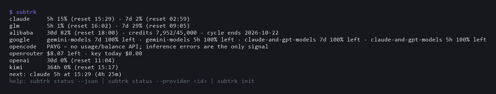
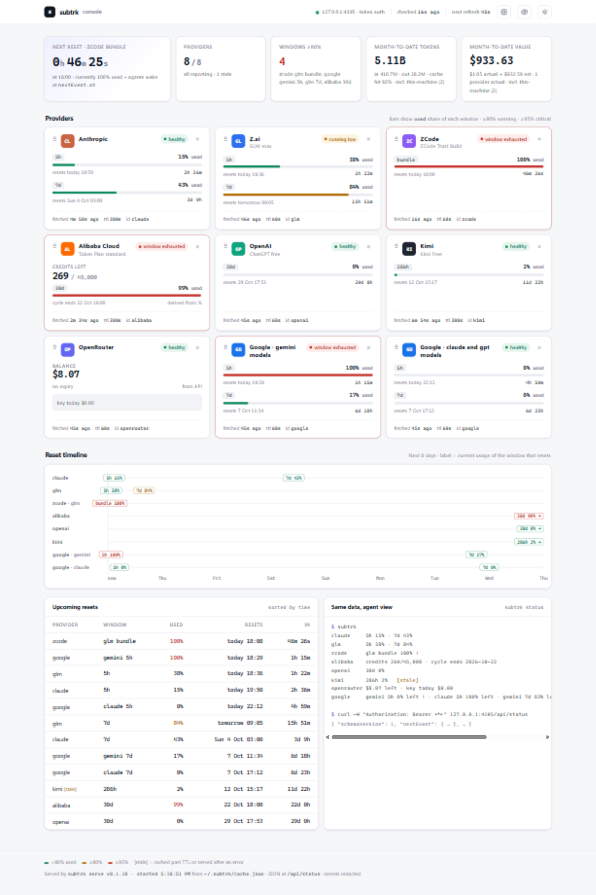
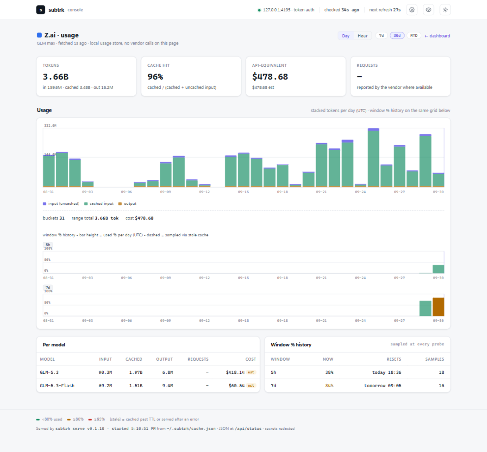

# subtrk

[](https://github.com/ChaosChild/subtrk/actions/workflows/ci.yml)
[](https://www.npmjs.com/package/subtrk)
[](https://github.com/ChaosChild/subtrk/blob/main/package.json)
[](LICENSE)
[](https://socket.dev/npm/package/subtrk)

**AI subscription quotas in one command.** `subtrk` reports remaining usage for
the plans its contributors use – today Claude Pro, Z.ai GLM Coding Plan, Alibaba
Cloud Model Studio, Google AI Pro, OpenCode Zen, OpenRouter, the ChatGPT plans
(via the OpenAI Codex CLI), the Kimi coding plans (via the Kimi Desktop app or
the Kimi Code CLI) and the z.ai Start Plan bundles (via the ZCode desktop app) –
in one compact view, designed first for the AI agents that work for you and
second for you.
Coverage expands as needs or requests come in: adding a provider is a contained
change (see the [implementation guide](docs/implementation-plan.md)), and PRs
adding providers are welcome.

Agents stop hitting brick walls at rate limits: `subtrk status --json` gives every
window's usage and reset time plus a computed `nextEvent`, so an agent can schedule a
wake-up at the reset instead of dying. Humans stop keeping a browser tab open per
provider.

```text
$ subtrk
claude     5h 13% (reset 18:04) · 7d 89% !
glm        5h 4% (reset 19:47) · 7d 61%
alibaba    credits 31,240/45,000 · cycle ends 2026-10-12
google     gemini-models 7d 0% left · claude-and-gpt-models 5h 100% left !
opencode   PAYG · no usage API (signals only)
openrouter $74.75 left · key today $1.20
next: claude 5h at 18:09 (4h 49m)
help: subtrk status --json | subtrk status --provider <id> | subtrk init
```



## Web console

```bash
subtrk serve
```

Starts the dashboard on a random `127.0.0.1` port and prints the URL to open –
one page for every tracked provider: usage bars per window (with ≥80%/≥95% warning
levels), credit pools, a 7-day reset timeline, upcoming resets, and the same
agent view the CLI prints, auto-refreshing on the cache heartbeat. The top row
carries month-to-date token and value cards (local calendar month). A provider
that reports several model classes (Google's Gemini and Claude/GPT, for example)
renders one card per class. When a provider's error says it is refreshable, its
card shows a **Refresh now** button that re-runs that provider's own refresh
action on the host. A gear-icon menu in the header toggles providers on/off, an
eye-icon menu shows or hides individual cards, every card has an × to hide
itself, and cards drag individually into any order – all persist across
restarts (saved to `~/.subtrk/config.json`, like `subtrk init`).



Every card is clickable into that provider's **usage page** – the headline
addition of M3: a day/hour token chart with the provider's window-% history on
the same time grid, a per-model table with API-equivalent costs labeled
actual / est / blended, and the live windows, all served from the local usage
store with no vendor calls while you browse (details in
[Usage history](#usage-history)).



The server is loopback-only, requires a per-run token (delivered in the printed
URL), never emits CORS headers, and status stays read-only – toggles and card
order persist through the authenticated `POST /api/config` – see
[`docs/spec.md`](docs/spec.md) §`subtrk serve` for the security design.

## Why

Modern AI workstations juggle several subscriptions with different windows (5-hour,
weekly, monthly credit pools) and different dashboards. Without a combined view you
over-plan, under-use, and your agents discover limits by crashing into them. `subtrk`
reads each vendor's usage the same way their own CLIs do, normalizes it, caches it
politely, and speaks both human and agent.

## Design principles

- **Agents first** – follows the [AXI principles](https://axi.md): token-efficient
  output, pre-computed aggregates (`nextEvent`, `recheckAfter`), structured errors
  you branch on by kind (never by message text), exit codes with meaning, no
  interactive traps in agent paths, content before help.
- **Zero runtime dependencies** – TypeScript executed directly by Node ≥22.18
  (type stripping). No build step; the dev toolchain (typecheck, linter) is
  dev-only and never ships.
- **Polite by construction** – one shared TTL cache (`~/.subtrk/cache.json`) with
  stale-while-revalidate and a hard 300s floor on the one endpoint known to punish
  polling. Six agents checking simultaneously produce one upstream request.
- **Fail soft, per provider** – one broken endpoint never breaks the others; errors
  carry a `kind` and a `hint`, and stale cached numbers beat a wall of text.
- **Secrets stay put** – reads the credential files your CLIs already maintain
  (read-only), stores its own keys in `~/.subtrk/env` (never global env vars), and
  mechanically redacts every secret from every output. The cache contains no secrets.

## Install

Requires Node ≥22.18.

No install needed – every command runs through npx:

```bash
npx subtrk init     # one-time interactive setup
npx subtrk serve    # web console
npx subtrk auth refresh --provider <id>   # re-authorise one provider (e.g. alibaba or google)
npx subtrk          # same as: npx subtrk status
```

Or install globally:

```bash
npm install -g subtrk
subtrk init       # one-time interactive setup
```

From source (development):

```bash
git clone https://github.com/ChaosChild/subtrk.git
cd subtrk
npm install       # dev-only toolchain
npm link          # puts `subtrk` on PATH (subtrk.cmd on Windows)
```

`subtrk init` first asks which providers you track – a numbered listing answered
with numbers and/or ids (e.g. `1 3 5` or `claude, google`) – and stores the
selection in `~/.subtrk/config.json`; the checks below then only cover those.
Edit the file or re-run `subtrk init` to change the selection, delete it to
track all seven again. It runs the Alibaba login flow (`bl auth login --api-key` +
`--console` browser login), prompts for OpenRouter keys (hidden input, saved to
`~/.subtrk/env`), and verifies each provider honestly – `[ok]` only when a
credential actually works.

### Agent instructions

`subtrk init --agent <harness>` appends a short marked section to a harness's
GLOBAL agent instructions file, so the agent knows how to call subtrk:

| harness | file |
|---|---|
| `claude` | `~/.claude/CLAUDE.md` (Claude Code global memory) |
| `zcode` | `~/.zcode/AGENTS.md` |
| `codex` | `~/.codex/AGENTS.md` |
| `opencode` | `~/.config/opencode/AGENTS.md` (this exact path on Windows too) |
| `agy` | `~/.gemini/AGENTS.md` (Antigravity; the path is `~/.gemini` by convention) |

The write is idempotent – re-running replaces only subtrk's block between the
`<!-- subtrk:begin -->` / `<!-- subtrk:end -->` markers and never touches
anything else; to remove it, delete the block between the markers. On any other
harness, paste this body into its instructions file manually (without the
markers – `subtrk init --agent` wraps it in them):

```markdown
## subtrk

`subtrk` reports remaining quota for the AI plans configured on this machine.
Use it before committing to large or long-running work on a provider –
discovering a rate limit mid-task wastes the work – when a provider starts
failing with quota or rate-limit errors, and on wake-ups: `recheckAfter` and
`nextEvent.at` say when new information can exist, so schedule around them
instead of polling.

Plain `subtrk` or `subtrk status` prints a compact view; `subtrk status --json`
is the machine-readable contract:

- `providers[].windows[]` – per-provider usage windows with `usedPercent` and `resetsAt` (ISO-8601 UTC)
- `nextEvent.at` – the earliest time new information can exist; schedule wake-ups there, never poll
- `recheckAfter` – heartbeat when no `nextEvent` applies
- `error.kind` – branch on it, never on message text; `error.remedy` is the exact command that fixes the error
- exit codes: 0 ran · 1 runtime failure · 2 usage error · 3 --strict violation
- plain calls go through a shared TTL cache and are polite; `--fresh` only when a result is actively stale
- when an error's `remedy` is `subtrk auth refresh --provider <id>`, the provider's login expired – you may run that command yourself, but it opens a browser tab on this machine: tell the operator first and wait for their go
- any other remedy is an interactive operator step (logins, setup prompts) – surface it verbatim instead of attempting it
- a missing provider means the plan is not configured on this machine, not an error
```

## Providers

| Provider | Plan | Reads | Windows | Status |
|---|---|---|---|---|
| Anthropic | Claude Pro (personal) | `api.anthropic.com/api/oauth/usage` via the OAuth token Claude Code already stores | 5h + 7d | reverse-engineered, de-facto standard |
| Z.ai | GLM Coding Plan | the same monitor endpoint ZCode itself uses | 5h + weekly | unofficial, officially plugin-endorsed |
| Alibaba Cloud | Model Studio Token Plan (intl) | official `bl` CLI raw gateway passthrough (`bl console call`) | 30-day credits pool (monthly-only since 2026-09-22) | official (via bl) |
| Google | AI Pro (personal) | Antigravity desktop app's local language server (the dashboard's own view); remote Code Assist summary fallback with read-only self-refresh | per-family 5h/7d (gemini + claude-and-gpt families) | best-effort – without the app it briefly runs the app's own language server standalone; labeled remote fallback as last resort |
| OpenCode | Zen pay-as-you-go | no usage/balance API exists for PAYG | – | signals only (honest note) |
| OpenRouter | pay-as-you-go | `/api/v1/key` (+ `/api/v1/credits` and usage history via a management key) | – | official |
| OpenAI | ChatGPT plan via Codex | the Codex CLI's own ChatGPT usage endpoint, read from its stored login | free: one 30-day window; paid: 5h + weekly | official client endpoint, not a documented public API |
| Kimi | Kimi Desktop / Kimi Code CLI coding plans | the Kimi Desktop app's key or the Kimi Code CLI's OAuth login against the coding usage endpoints | free: one quota window; CLI login: 5h + 7d + monthly | official client endpoints, not a documented public API |
| ZCode | z.ai Start Plan bundles | the z.ai balance API via the local credential store (the ZCode desktop app's stored login) | one window per per-model token bucket, bucket expiry as reset | official client endpoint, undocumented |

None of these vendors officially supports third-party quota readers except Alibaba
and OpenRouter; the others are the same calls their own CLIs make, and can change.
`subtrk` isolates that churn in small per-provider modules and degrades cleanly.
These are the providers the contributors use today – the set grows as needs or
requests come in, and additions are welcome as PRs (the
[implementation guide](docs/implementation-plan.md) walks through it).

## Usage history

Beyond the quota snapshot, `subtrk` keeps a local usage ledger in
`~/.subtrk/usage.json` (hourly and daily token buckets per provider and model,
window-% samples, a weekly pricing cache). It fills from the calls you already
make – every `subtrk status`, dashboard refresh and `subtrk usage` harvests
the due sources, best-effort, and history is only ever written idempotently so
concurrent agents cannot double count.

```bash
subtrk usage                     # month-to-date tokens + API-equivalent cost
subtrk usage --json              # machine-readable (per-provider, per-model)
subtrk usage --provider glm      # one provider (includes its local harvest)
subtrk usage --days 7 --hour     # last 7 days, hourly buckets
subtrk usage --rebuild           # re-derive range-API history from the sources
```

On the dashboard (screenshot above), the month-to-date cards sum the local
calendar month, this-machine harvests included and labeled, and every provider
card opens its usage page.

What you get per provider depends on what the vendor exposes: GLM, OpenRouter
and Alibaba report token splits; OpenRouter costs are the vendor's own numbers
(actual) while the rest are list-price estimates, always labeled; zcode bundles
report totals only and are priced with your observed z.ai mix. OpenAI and
Claude combine **this-machine token harvests** (Codex rollout files / Claude
Code transcripts — real tokens, labeled "this machine", included in the
month-to-date cards) with OpenAI's server-side daily plan share; Google and
Kimi expose percentages only, so their usage pages show window-% history
instead of tokens.

### Where the usage comes from – and what it can't do

`subtrk` is **not a proxy** – it never sits in the request path, so it cannot
meter your traffic request by request. Token numbers come from two honest
sources: the vendors' own usage surfaces where they exist (Z.ai's per-model
credit-usage detail, OpenRouter's activity/analytics, Alibaba's token-plan
telemetry, OpenAI's daily breakdown), and local artifacts your tools already
write (Claude Code transcripts, Codex rollout files) for providers with no
server-side history. Everything else – Claude, Google, Kimi – exposes only
window percentages, and subtrk shows exactly that: sampled % history, never
invented tokens. Local harvests describe this machine only; usage from your
other devices appears solely through the vendor's server-side numbers or the
window percentages. API-equivalent costs are computed from list prices
(OpenRouter's public catalog, refreshed weekly, plus a bundled vendor table)
and are estimates of what the same tokens would have cost pay-as-you-go – not
what your subscription actually charges you.

**Management key note.** OpenRouter's usage history needs a *management key*
(openrouter.ai/settings/management-keys), which `subtrk init` offers as an
explicit option. It is account-admin scoped – it can read usage across all
your OpenRouter keys and create keys – and it is stored plaintext in
`~/.subtrk/env` like every other subtrk secret, inside your user profile's
trust envelope. Skipping it costs nothing else: everything keeps working and
OpenRouter history just says "unavailable". Decide for yourself.

## For agents

```bash
subtrk status --json
```

- `providers[].windows[].resetsAt` – ISO-8601 UTC reset instants.
- `nextEvent.at` – the earliest time new information can exist
  (`max(resetsAt, fetchedAt + ttl)`); schedule the wake-up there.
- `recheckAfter` – heartbeat when no `nextEvent` applies.
- `providers[].error.kind` – branch on it: `no-credentials`, `expired-token`,
  `tool-missing`, `rate-limited`, `forbidden`, `not-readable-remotely`,
  `parse-failure`, `subprocess-failed`, `timeout`, `http-error`.
- `providers[].error.remedy` – exact CLI line to run when present;
  `refreshable: true` on a failed provider means `subtrk auth refresh
  --provider <id>` can re-authorise it.
- Exit codes: `0` ran (per-provider errors are in the output) · `1` CLI/runtime
  failure · `2` usage error · `3` `--strict` violation.
- On Windows, spawn `subtrk.cmd` (or use `shell: true`) – there is no bare `.exe`.

A ZCode/Claude Code-style harness can check before a large task and, at ≥95% of a
window, schedule a wake-up at `nextEvent.at` and continue on another provider in the
meantime – no intervention needed.

## Configuration

- `~/.subtrk/config.json` – `{ "enabled": ["claude", "glm", ...] }` (absent = all).
- `~/.subtrk/env` – `OPENROUTER_API_KEY`, `OPENROUTER_MANAGEMENT_KEY`, optional
  `OPENCODE_API_KEY` (dotenv format; process env wins). Written by `subtrk init`.
- Everything else is read from the credential files your CLIs already own:
  `~/.claude/.credentials.json`, `~/.zcode/cli/config.json`, `~/.gemini/*`,
  `~/.codex/auth.json`, `~/.local/share/opencode/auth.json`, `bl`'s own store.

## Security notes

- `subtrk` is read-only towards vendors in its status probes; the one
  deliberate exception is `subtrk auth refresh` (D9), which re-runs a
  provider's own interactive login when asked.
- Secrets are mechanically redacted from all output; the cache stores normalized
  quota data only. See `docs/spec.md` §Redaction.
- The usage ledger (`~/.subtrk/usage.json`) holds token counts, window
  percentages and list prices – never credentials. The optional OpenRouter
  management key is more powerful than an inference key (account-admin
  scoped); storing it is an explicit opt-in with the trade-off spelled out in
  `subtrk init` and §Usage history.
- `~/.subtrk/env` holds plaintext keys inside your user profile – the same trust
  envelope as the vendor credential files it reads. Design decisions and known
  trade-offs are tracked in `docs/decisions.md`.

## Documentation

- [`docs/spec.md`](docs/spec.md) – full CLI specification (output contract, cache,
  provider integrations, `subtrk init`).
- [`docs/decisions.md`](docs/decisions.md) – design decisions D1–D11 with rationale.
- [`docs/implementation-plan.md`](docs/implementation-plan.md) – implementation
  guide: layout, coding rules, how to add a provider.
- [`docs/phases.md`](docs/phases.md) – roadmap (CLI, web console and usage
  analytics done; parked).

## License

MIT
